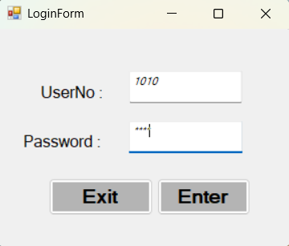
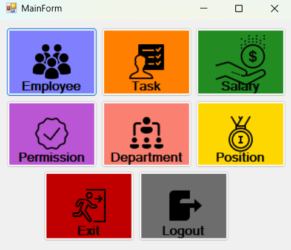
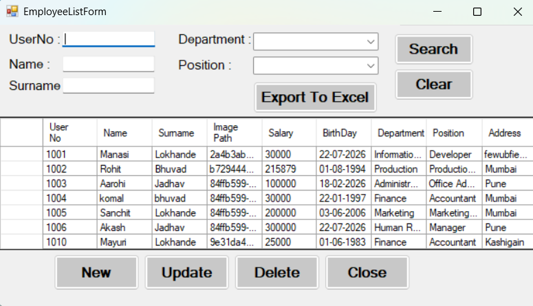
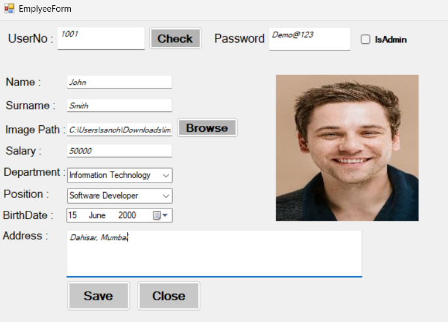
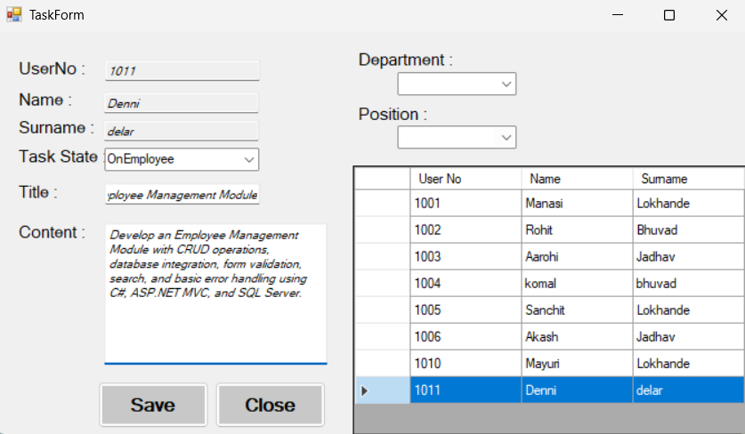
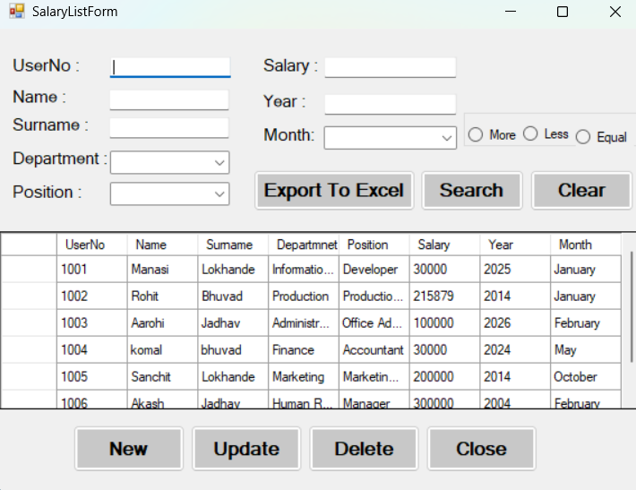
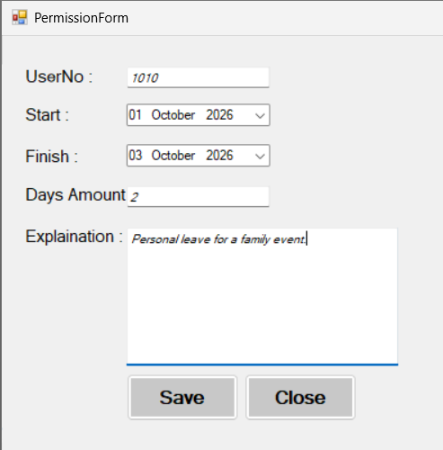
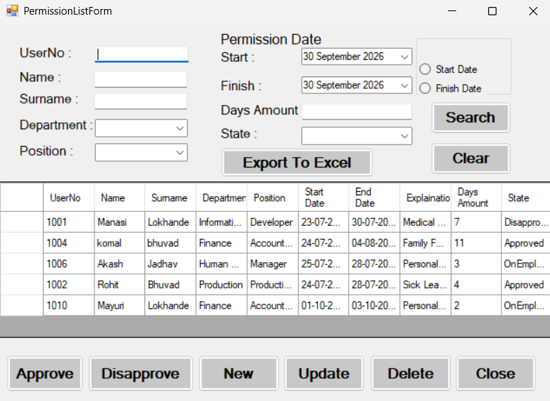
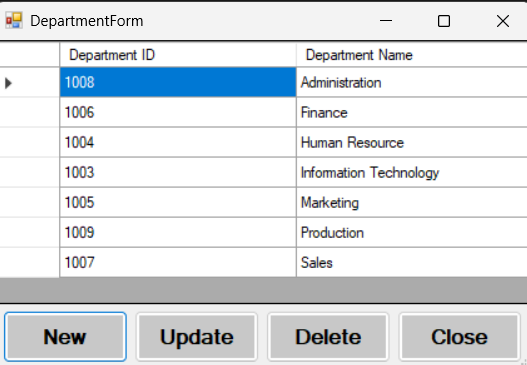

# Personnel Tracking System

A desktop-based **Personnel Tracking System** developed using **C# Windows Forms** and **SQL Server**. The application provides modules for managing employees, departments, positions, tasks, salaries, permissions, and user access.

## 📌 Project Overview

The Personnel Tracking System is designed to simplify personnel management by providing a centralized application for storing, updating, viewing, and managing employee-related information.

The project follows a layered architecture using **UI, BLL, DAL, and DTO** components.

## 🛠️ Technologies Used

- C#
- .NET Windows Forms
- SQL Server
- ADO.NET
- LINQ
- DAO / DTO
- N-Tier Architecture
- Microsoft Office Interop

## ✨ Features

### 🔐 Login & User Access

- User login
- User access control
- Permission-based functionality

### 👨‍💼 Employee Management

- Add employee
- Update employee
- Delete employee
- View employee records
- Search employee information
- Employee image management
- Export employee data to Excel

### 🏢 Department Management

- Add department
- Update department
- Delete department
- View department records

### 💼 Position Management

- Add position
- Update position
- Delete position
- View position records

### 📋 Task Management

- Add tasks
- Update tasks
- Delete tasks
- Manage employee-related tasks

### 💰 Salary Management

- Manage employee salary records
- View salary information
- Export salary data to Excel

### 📝 Permission Management

- Create permission requests
- View permission records
- Approve or disapprove permission requests

### 🗄️ Database

- SQL Server database integration
- CRUD operations
- Stored procedures
- Triggers
- Foreign key relationships

## 🏗️ Project Architecture
```text
PersonnelTrackingSystem
│
├── UI
│   └── Windows Forms
│
├── BLL
│   └── Business Logic Layer
│
├── DAL
│   └── Data Access Layer
    └── Data Transfer Objects
```

### Layer Responsibilities

**UI (User Interface)**
Handles forms, user input, buttons, data grids, and displaying information.

**BLL (Business Logic Layer)**
Handles the business logic between the user interface and data access layers.

**DAL (Data Access Layer)**
Handles database operations and communication with SQL Server.

**DTO (Data Transfer Object)**
Transfers data between different layers of the application.

## 🖥️ Application Screenshots

### 🔐 Login



### 🏠 Main Dashboard



### 👨‍💼 Employee List



### ➕ Employee Form



### 📋 Task Management



### 💰 Salary Management



### 📝 Permission Form



### ✅ Permission Management



### 🏢 Department Management



## 🗃️ Database

The application uses **SQL Server** to store and manage personnel-related data.

The system includes data management for:

* Employees
* Departments
* Positions
* Salaries
* Tasks
* Permissions
* Users
* Access permissions

## 📊 Excel Export

The application includes Excel export functionality for selected records, allowing personnel-related information to be exported for further use.

## 🚀 How to Run

### Prerequisites

* Visual Studio
* .NET Framework compatible with the project
* SQL Server
* SQL Server Management Studio (SSMS)
* Microsoft Excel for Excel export functionality

### Steps

1. Clone the repository.
2. Open the solution in Visual Studio.
3. Create or import the required SQL Server database.
4. Update the database connection string according to your SQL Server configuration.
5. Build the solution.
6. Run the application.

## 🎯 Learning Outcomes

Through this project, I gained practical experience in:

* C# Windows Forms development
* SQL Server database integration
* CRUD operations
* N-Tier architecture
* DAO and DTO
* LINQ
* Stored procedures and triggers
* Database relationships
* User access and permissions
* Debugging and troubleshooting
* Excel data export

## 👩‍💻 Developer

**Manasi Lokhande**

B.Sc. Information Technology

GitHub: [manasi-lokhande](https://github.com/manasi-lokhande)

---

⭐ Thank you for visiting this project!
